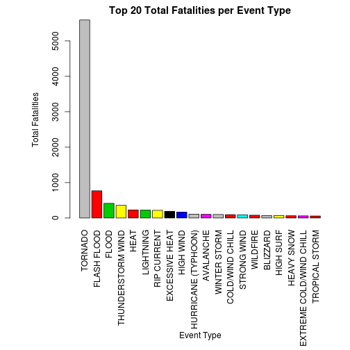
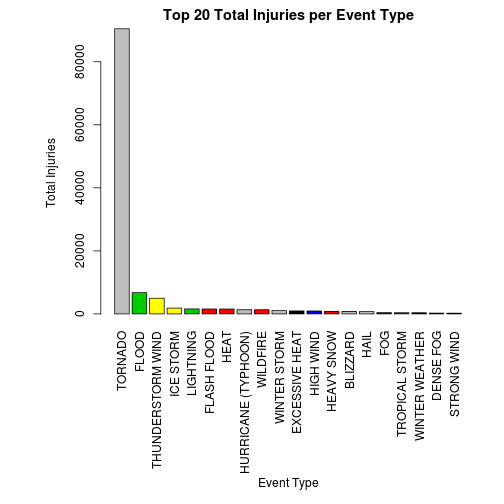
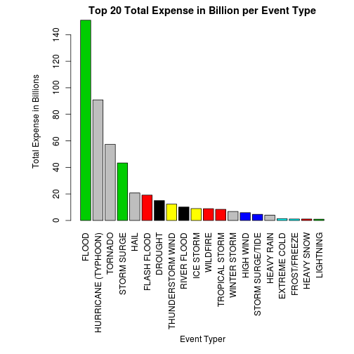

Impact of Storm and Weather events on public health and economy
===============================================================


## Synopsis
 In this report we try to show which storm and weather have a greater impact 
 on the public health and economic consequences for communties and muncipalities.
 Inorder to investigate this hypothesis we have gathered the data from
 U.S. National Oceanic and Atmospheric Administration's (NOAA) storm database.
 The events in the database start in the year 1950 and end in November 2011. 
 This database tracks characteristics of major storms and weather events in 
 the United States, including when and where they occur, as well as estimates 
 of any fatalities, injuries, and property damage. From this data taking the
 top 20 events, we found Tornado's are major danger to public health as it results
 in more fatalities and Injuries. Flood's on the other hand have major impact on
 economic consequences.
 
## Data Processing
 
 set global cache options for R 
 

```r
# set global options
opts_chunk$set(echo = TRUE, cache = TRUE, message = FALSE)
```

 
 define a name for the bzip file and download the file
 

```r
bzFilename <- "stomdata.bz2"

fileUrl <- "https://d396qusza40orc.cloudfront.net/repdata%2Fdata%2FStormData.csv.bz2"

download.file(fileUrl, destfile = bzFilename, method = "curl")
```

 
load the data into a data variable by reading the download file using read.csv 
with a field seperator "," and quote character "\"", but we need to bzfile
before passing it to read.csv function


```r
# read data
data <- read.csv(bzfile(bzFilename), sep = ",", quote = "\"")

# print the column names
colnames(data)
```

```
##  [1] "STATE__"    "BGN_DATE"   "BGN_TIME"   "TIME_ZONE"  "COUNTY"    
##  [6] "COUNTYNAME" "STATE"      "EVTYPE"     "BGN_RANGE"  "BGN_AZI"   
## [11] "BGN_LOCATI" "END_DATE"   "END_TIME"   "COUNTY_END" "COUNTYENDN"
## [16] "END_RANGE"  "END_AZI"    "END_LOCATI" "LENGTH"     "WIDTH"     
## [21] "F"          "MAG"        "FATALITIES" "INJURIES"   "PROPDMG"   
## [26] "PROPDMGEXP" "CROPDMG"    "CROPDMGEXP" "WFO"        "STATEOFFIC"
## [31] "ZONENAMES"  "LATITUDE"   "LONGITUDE"  "LATITUDE_E" "LONGITUDE_"
## [36] "REMARKS"    "REFNUM"
```

```r

# print the first few rows
head(data, 2)
```

```
##   STATE__          BGN_DATE BGN_TIME TIME_ZONE COUNTY COUNTYNAME STATE
## 1       1 4/18/1950 0:00:00     0130       CST     97     MOBILE    AL
## 2       1 4/18/1950 0:00:00     0145       CST      3    BALDWIN    AL
##    EVTYPE BGN_RANGE BGN_AZI BGN_LOCATI END_DATE END_TIME COUNTY_END
## 1 TORNADO         0                                               0
## 2 TORNADO         0                                               0
##   COUNTYENDN END_RANGE END_AZI END_LOCATI LENGTH WIDTH F MAG FATALITIES
## 1         NA         0                        14   100 3   0          0
## 2         NA         0                         2   150 2   0          0
##   INJURIES PROPDMG PROPDMGEXP CROPDMG CROPDMGEXP WFO STATEOFFIC ZONENAMES
## 1       15    25.0          K       0                                    
## 2        0     2.5          K       0                                    
##   LATITUDE LONGITUDE LATITUDE_E LONGITUDE_ REMARKS REFNUM
## 1     3040      8812       3051       8806              1
## 2     3042      8755          0          0              2
```


### Transformations

Filter and include only the values for the columns
FATALITIES , INJURIES,  PROPDMG and  CROPDMG when the values are greater than
zero


```r
m <- subset(data, FATALITIES > 0 | INJURIES > 0 | PROPDMG > 0 | CROPDMG > 0)
```


Convert all the values in EVTYPE column to upper case to clean the data

```r
m[, c("EVTYPE")] <- toupper(m[, c("EVTYPE")])
```


Clean most of the values by correcting and converting them to the
event types as described in 
https://d396qusza40orc.cloudfront.net/repdata%2Fpeer2_doc%2Fpd01016005curr.pdf.
so most of the identical event types are grouped together


```r

m[m$EVTYPE == "AVALANCE", c("EVTYPE")] <- "AVALANCHE"

m[grep("BLIZZARD*", m$EVTYPE), c("EVTYPE")] <- "BLIZZARD"

m[grep("HAIL*", m$EVTYPE), c("EVTYPE")] <- "HAIL"

m[grep("HEAVY RAIN*", m$EVTYPE), c("EVTYPE")] <- "HEAVY RAIN"

m[grep("WATERSPOUT*", m$EVTYPE), c("EVTYPE")] <- "WATERSPOUT"

m[grep("HURRICANE*", m$EVTYPE), c("EVTYPE")] <- "HURRICANE"

m[grep("THUNDERSTORM*|TUNDERSTORM WIND*|TSTM WIND*|THUDERSTORM WINDS*", m$EVTYPE), 
    c("EVTYPE")] <- "THUNDERSTORM WIND"

m[grep("THUNDEERSTORM WINDS*", m$EVTYPE), c("EVTYPE")] <- "THUNDERSTORM WIND"

m[grep("THUNDERESTORM WINDS*", m$EVTYPE), c("EVTYPE")] <- "THUNDERSTORM WIND"

m[grep("THUNDERTORM WINDS*", m$EVTYPE), c("EVTYPE")] <- "THUNDERSTORM WIND"

m[grep("THUNERSTORM WINDS*", m$EVTYPE), c("EVTYPE")] <- "THUNDERSTORM WIND"

m[grep("THUNDERSTROM WIND*", m$EVTYPE), c("EVTYPE")] <- "THUNDERSTORM WIND"

m[grep("THUNDERSTROM WIND*", m$EVTYPE), c("EVTYPE")] <- "THUNDERSTORM WIND"

m[grep("TSTMW*", m$EVTYPE), c("EVTYPE")] <- "THUNDERSTORM WIND"

m[grep("TORNADO*", m$EVTYPE), c("EVTYPE")] <- "TORNADO"

m[grep("TORNDAO*", m$EVTYPE), c("EVTYPE")] <- "TORNADO"

m[grep("RIP CURRENT*", m$EVTYPE), c("EVTYPE")] <- "RIP CURRENT"

m[grep("STRONG WIND*", m$EVTYPE), c("EVTYPE")] <- "STRONG WIND"

m[grep("LIGHTNING*", m$EVTYPE), c("EVTYPE")] <- "LIGHTNING"

m[grep("LIGHTING*|LIGNTNING*", m$EVTYPE), c("EVTYPE")] <- "LIGHTNING"

m[grep("FLASH FLOOD*", m$EVTYPE), c("EVTYPE")] <- "FLASH FLOOD"

m[grep("WINTER WEATHER*", m$EVTYPE), c("EVTYPE")] <- "WINTER WEATHER"

m[grep("WINTER STORM*", m$EVTYPE), c("EVTYPE")] <- "WINTER STORM"

m[grep("TROPICAL STORM*", m$EVTYPE), c("EVTYPE")] <- "TROPICAL STORM"

m[grep("HEAVY SNOW*", m$EVTYPE), c("EVTYPE")] <- "HEAVY SNOW"

m[grep("HEAVY RAIN*|HVY RAIN*", m$EVTYPE), c("EVTYPE")] <- "HEAVY RAIN"

m[grep("FLOOD/FLASH*|FLOOD FLASH*", m$EVTYPE), c("EVTYPE")] <- "FLASH FLOOD"

m[grep("FLOODING|FLOOD/RIVER FLOOD|FLOODS|FLOOD/RAIN/WINDS", m$EVTYPE), c("EVTYPE")] <- "FLOOD"

m[grep("WILDFIRES*|WILD FIRES*|WILDFIRE*|WILD/FOREST*", m$EVTYPE), c("EVTYPE")] <- "WILDFIRE"

m[grep("HURRICANE*|TYPHOON*", m$EVTYPE), c("EVTYPE")] <- "HURRICANE (TYPHOON)"
```


Creating a marginal data frame for expense conversion to billions taking
billion as base line 0 becomes 1e-9 in terms of billions, 1 becomes 1e-8 in
terms of billions and so on and similarly for k the value is 1e-6 in terms of 
billions, for h the value is 1e-7 in terms of billions and 
for m the value is 1e-3 in terms of billions


```r
mag <- c(0, 1, 2, 3, 4, 5, 6, 7, 8, 9, "k", "K", "m", "M", "b", "B", "h", "H")

magv <- c(1e-09, 1e-08, 1e-07, 1e-06, 1e-05, 1e-04, 0.001, 0.01, 0.1, 1, 1e-06, 
    1e-06, 0.001, 0.001, 1, 1, 1e-07, 1e-07)

magdf <- data.frame(mag = mag, magv = magv)
```


Converting the factor values in CROPDMGEXP and PROPDMGEXP to values using
the marginal dataframe and adding the columns CROPDMGEXPV and PROPDMGEXP


```r
cb <- subset(m, m$PROPDMGEXP %in% magdf$mag | m$CROPDMGEXP %in% magdf$mag)

cb$CROPDMGEXPV <- sapply(cb$CROPDMGEXP, function(x) {
    if (x %in% magdf$mag) 
        magdf[mag == x, 2] else 0
})

cb$PROPDMGEXPV <- sapply(cb$PROPDMGEXP, function(x) {
    if (x %in% magdf$mag) 
        magdf[mag == x, 2] else 0
})
```


Adding the values (CROPDMG * CROPDMGEXPV) and (PROPDMG * PROPDMGEXPV)
to create TOTLEXP column


```r
cb <- transform(cb, TOTLEXP = CROPDMG * CROPDMGEXPV + PROPDMG * PROPDMGEXPV)
```


## Results

### Most harmful events to population health

The most harmful events to population health can be assessed by taking the
top twenty event types for fatalities and injuries

#### Using Fatalities to see the most damaging events for population health

We calculate the total fatalities for each event type

```r
tf <- tapply(cb$FATALITIES, cb$EVTYPE, sum)

# creating a data frame which we can use
tfdf <- data.frame(eventtype = names(tf), fat = as.numeric(tf))

# order by fatalities descending
tfdf <- tfdf[order(tfdf$fat, decreasing = TRUE), ]

# take top 20
tfdf <- tfdf[1:20, ]

print(tfdf)
```

```
##                   eventtype  fat
## 168                 TORNADO 5591
## 42              FLASH FLOOD  768
## 43                    FLOOD  413
## 167       THUNDERSTORM WIND  357
## 66                     HEAT  227
## 115               LIGHTNING  222
## 135             RIP CURRENT  216
## 33           EXCESSIVE HEAT  188
## 84                HIGH WIND  166
## 96      HURRICANE (TYPHOON)  109
## 6                 AVALANCHE  103
## 192            WINTER STORM  100
## 18          COLD/WIND CHILL   94
## 165             STRONG WIND   91
## 186                WILDFIRE   79
## 8                  BLIZZARD   70
## 79                HIGH SURF   70
## 74               HEAVY SNOW   64
## 38  EXTREME COLD/WIND CHILL   60
## 170          TROPICAL STORM   56
```


We create a barplot showing the top 20 fatalities


```r
par(mar = c(13, 7, 2, 2), las = 3)

barplot(tfdf$fat, names.arg = tfdf$eventtype, col = tfdf$eventtype, ylab = "Total Fatalities", 
    main = "Top 20 Total Fatalities per Event Type")

title(xlab = "Event Type", line = 11)
```

 


#### Using Injuries to see the most damaging events for population health

We calculate the total injuries for each event type

```r
inj <- tapply(cb$INJURIES, cb$EVTYPE, sum)

# creating a data frame which we can use
injdf <- data.frame(eventtype = names(inj), inju = as.numeric(inj))

# order by fatalities descending
injdf <- injdf[order(injdf$inju, decreasing = TRUE), ]

# take top 20
injdf <- injdf[1:20, ]

print(injdf)
```

```
##               eventtype  inju
## 168             TORNADO 90472
## 43                FLOOD  6754
## 167   THUNDERSTORM WIND  4977
## 103           ICE STORM  1847
## 115           LIGHTNING  1599
## 42          FLASH FLOOD  1570
## 66                 HEAT  1554
## 96  HURRICANE (TYPHOON)  1328
## 186            WILDFIRE  1328
## 192        WINTER STORM  1059
## 33       EXCESSIVE HEAT   949
## 84            HIGH WIND   927
## 74           HEAVY SNOW   787
## 8              BLIZZARD   779
## 64                 HAIL   720
## 44                  FOG   455
## 170      TROPICAL STORM   380
## 193      WINTER WEATHER   374
## 22            DENSE FOG   254
## 165         STRONG WIND   246
```


We create a barplot showing the top 20 fatalities


```r
par(mar = c(13, 7, 2, 2), las = 3)

barplot(injdf$inju, names.arg = injdf$eventtype, col = injdf$eventtype, ylab = "Total Injuries", 
    main = "Top 20 Total Injuries per Event Type")

title(xlab = "Event Type", line = 11)
```

 


From this fatalities graph and injuries graph it shows **TORNADO's** 
have a great impact on the population health

### Assessing which event has greatest economic consequence

First we group the total exp (CROPEXP * CROPDMG+ PROPEXP * PROPDMG) by event type 
and order the rows by exp decreasing and take the top 20 events that contributed 
to more economic consequences. There is a caveat here I haven't considered the 
deflation of money across the years


```r
ae <- tapply(cb$TOTLEXP, cb$EVTYPE, sum)

# creating a data frame which we can use
aedf <- data.frame(eventtype = names(ae), exp = as.numeric(ae))

# order by expense descending
aedf <- aedf[order(aedf$exp, decreasing = TRUE), ]

# take top 20
aedf <- aedf[1:20, ]

print(aedf)
```

```
##               eventtype      exp
## 43                FLOOD 150.8907
## 96  HURRICANE (TYPHOON)  90.8725
## 168             TORNADO  57.3671
## 163         STORM SURGE  43.3235
## 64                 HAIL  20.7372
## 42          FLASH FLOOD  19.1215
## 25              DROUGHT  15.0187
## 167   THUNDERSTORM WIND  12.3470
## 137         RIVER FLOOD  10.1484
## 103           ICE STORM   8.9670
## 186            WILDFIRE   8.8943
## 170      TROPICAL STORM   8.4093
## 192        WINTER STORM   6.7819
## 84            HIGH WIND   5.9086
## 164    STORM SURGE/TIDE   4.6420
## 72           HEAVY RAIN   4.0443
## 37         EXTREME COLD   1.3807
## 53         FROST/FREEZE   1.1047
## 74           HEAVY SNOW   1.0812
## 115           LIGHTNING   0.9475
```


Now we create a bar graph showing the top events that caused great economic
sequences


```r
par(mar = c(13, 7, 2, 2), las = 3)

barplot(aedf$exp, names.arg = aedf$eventtype, col = aedf$eventtype, ylab = "Total Expense in Billions", 
    main = "Top 20 Total Expense in Billion per Event Type")

title(xlab = "Event Typer", line = 11)
```

 


From the graph its clear that **FLOOD's** have a great economic consequence
